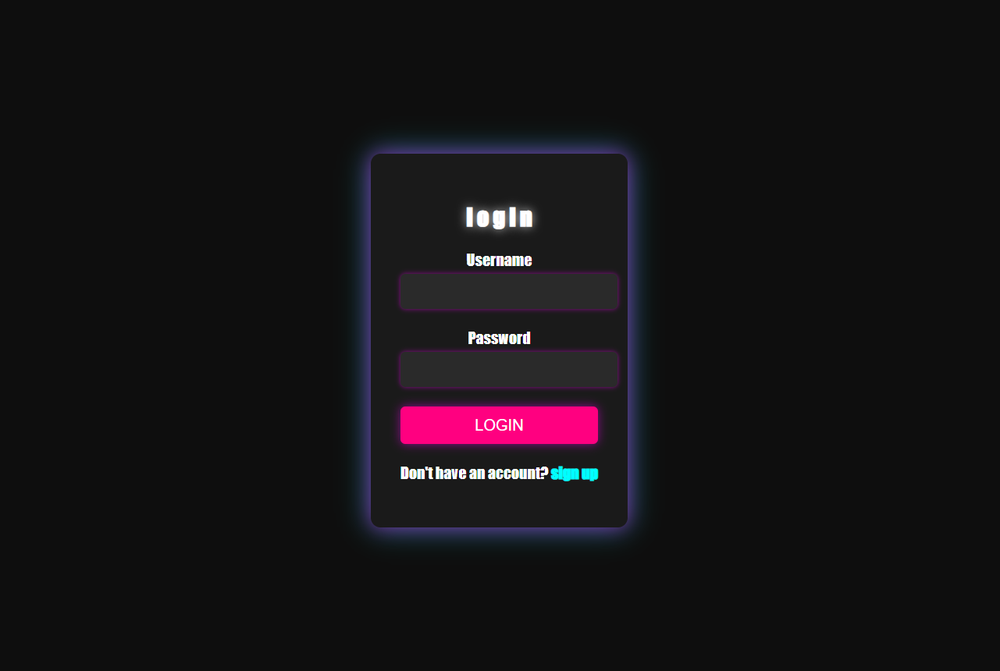

# Neon Login Page

This is a simple, attractive login page designed with a neon theme using HTML, CSS, and JavaScript. The design aims to provide a modern and engaging user experience.

## Demo

 <!-- Optionally, you can include a screenshot -->

## Features

- **Responsive Design**: The login page is responsive and adjusts well to different screen sizes.
- **Neon Theme**: Utilizes vibrant colors and glowing effects for an eye-catching appearance.
- **Basic Form Validation**: Includes required fields for username and password.

## Technologies Used

- HTML
- CSS
- JavaScript (optional for future enhancements)

## Getting Started

### Prerequisites

- A modern web browser (Chrome, Firefox, Safari, etc.)

